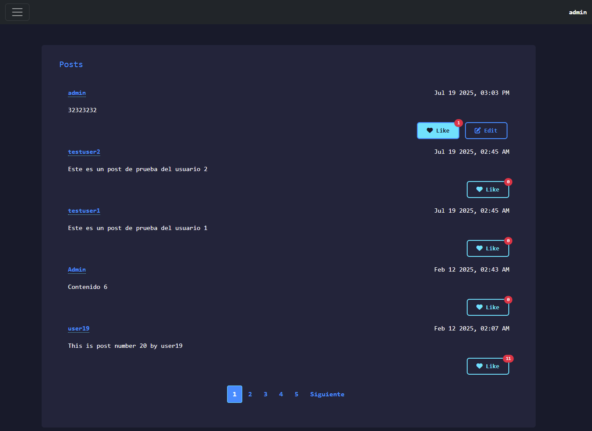
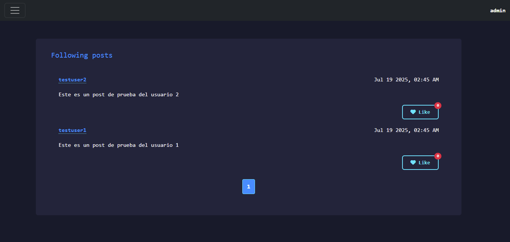
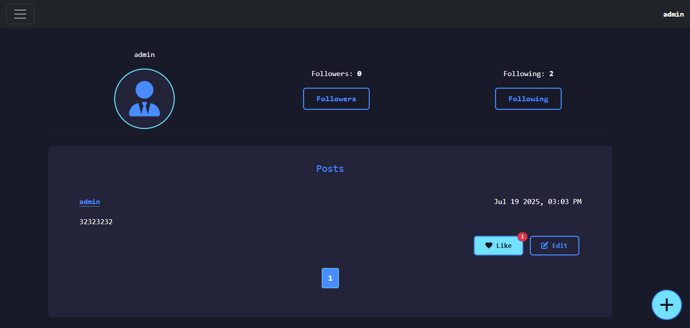

Traducelo este readme a inglés al pie de la letra, sin cambio alguno

# 🌐 Network

**Network** es una aplicación web desarrollada como parte del proyecto *CS50’s Web Programming with Python and JavaScript* (Harvard). Su objetivo es replicar las funcionalidades esenciales de una red social estilo *Threads*, permitiendo a los usuarios publicar contenido, seguir a otros, e interactuar con publicaciones en tiempo real.

## 📸 Capturas de pantalla

- **All Posts**
  
  
  
- **Following Posts**
  
  
  
- **My Profile**
  
  

## 🚀 Funcionalidades Principales

- Registro, inicio y cierre de sesión de usuarios
- Creación, edición y eliminación de publicaciones
- Sistema de seguidores (seguir/dejar de seguir usuarios)
- Reacciones: dar y quitar "me gusta" a publicaciones
- Paginación en todas las vistas de publicaciones
- Perfil de usuario con métricas de seguidores y seguidos
- Feed personalizado con publicaciones de usuarios seguidos
- Interacciones asincrónicas (AJAX) para "likes", "follows" y edición de publicaciones

## 💻 Interfaz de Usuario

- Diseño minimalista y profesional
- Paleta en tonos azules con acentos cian
- Inspirado en editores modernos (VSCode, JetBrains)
- Tipografía monoespaciada para una estética técnica
- Alto contraste y legibilidad optimizada

## 🛠️ Tecnologías Utilizadas

- **Backend**: Python 3, Django 5
- **Frontend**: HTML5, CSS3, JavaScript (AJAX)
- **Estilos**: Bootstrap 5 (utilidades y sistema de grillas)

## 📁 Estructura del Proyecto

### Archivos Principales

- **`manage.py`**: Script de administración de Django para ejecutar comandos como migraciones, servidor de desarrollo, etc.
- **`requirements.txt`**: Lista de dependencias de Python necesarias para el proyecto
- **`insertions.py`**: Script para poblar la base de datos con datos de prueba (usuarios, posts, likes, seguidores)
- **`db.sqlite3`**: Base de datos SQLite con todos los datos de la aplicación

### Directorio `network/` (Aplicación Principal)

- **`models.py`**: Define los modelos de datos (User y Post) con sus relaciones y métodos
- **`views.py`**: Contiene todas las vistas de la aplicación (páginas y endpoints AJAX)
- **`urls.py`**: Configuración de rutas URL de la aplicación
- **`admin.py`**: Configuración del panel de administración de Django
- **`tests.py`**: Pruebas unitarias de la aplicación

### Directorio `network/static/network/`

- **`styles.css`**: Estilos CSS personalizados con diseño minimalista y profesional
- **`script.js`**: JavaScript para interacciones AJAX (likes, follows, edición de posts)
- **`images/`**: Capturas de pantalla de la aplicación para la documentación

### Directorio `network/templates/network/`

- **`layout.html`**: Plantilla base con estructura HTML común y navegación
- **`index.html`**: Página principal con todas las publicaciones
- **`following.html`**: Feed de publicaciones de usuarios seguidos
- **`viewprofile.html`**: Perfil de usuario con métricas y publicaciones
- **`login.html`**: Formulario de inicio de sesión
- **`register.html`**: Formulario de registro de usuarios

### Directorio `project4/` (Configuración del Proyecto)

- **`settings.py`**: Configuración principal de Django (base de datos, aplicaciones, middleware, etc.)
- **`urls.py`**: Configuración de rutas URL principales del proyecto
- **`wsgi.py`**: Configuración para despliegue en producción
- **`asgi.py`**: Configuración para aplicaciones asíncronas

### Directorio `network/migrations/`

Contiene los archivos de migración de la base de datos que definen la evolución del esquema de datos.

## ⚡ Instalación Rápida

1. Clona el repositorio:
   ```bash
   git clone https://github.com/Wesleykyle2005/Network-web50
   cd network
   ```

2. Instala las dependencias:
   ```bash
   pip install -r requirements.txt
   ```

3. Aplica las migraciones:
   ```bash
   python manage.py makemigrations
   python manage.py migrate
   ```

4. (Opcional) Poblado de la base de datos para pruebas:
   ```bash
   python insertions.py
   ```
   Esto creará usuarios, posts, likes y relaciones de seguimiento aleatorias para pruebas y demostración.

5. Inicia el servidor de desarrollo:
   ```bash
   python manage.py runserver
   ```

6. Accede a la aplicación desde tu navegador en:
   [http://127.0.0.1:8000/](http://127.0.0.1:8000/)
