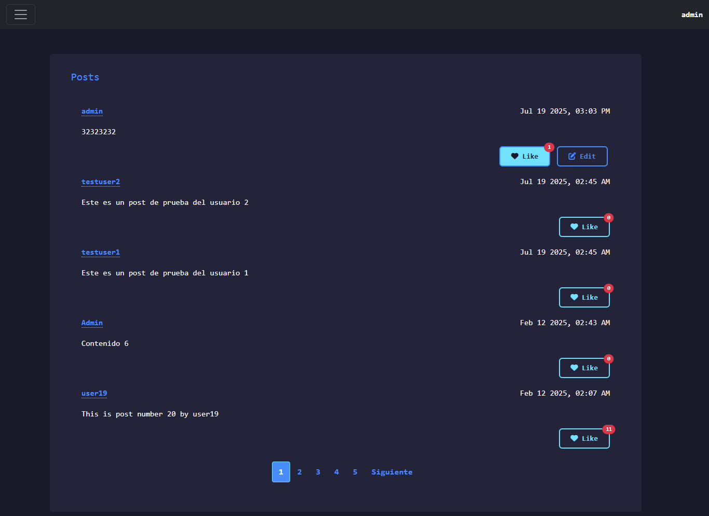
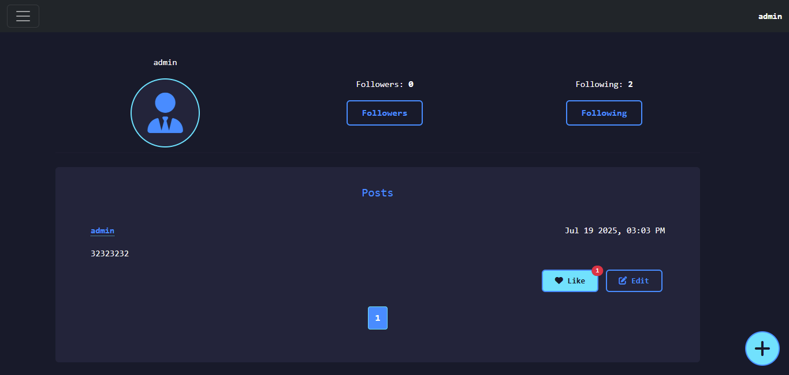

# 🌐 Network

**Network** is a web application developed as part of the *CS50’s Web Programming with Python and JavaScript* (Harvard) project. Its goal is to replicate the essential functionalities of a social network like *Threads*, allowing users to post content, follow others, and interact with posts in real-time.

## 📸 Screenshots

- **All Posts**
  
  
  
- **Following Posts**
  
  
  
- **My Profile**
  
  

## 🚀 Main Features

- User registration, login, and logout
- Creation, editing, and deletion of posts
- Follower system (follow/unfollow users)
- Reactions: like and unlike posts
- Pagination in all post views
- User profile with follower and following metrics
- Personalized feed with posts from followed users
- Asynchronous interactions (AJAX) for likes, follows, and post editing

## 💻 User Interface

- Minimalist and professional design
- Blue-toned color palette with cyan accents
- Inspired by modern editors (VSCode, JetBrains)
- Monospaced typography for a technical aesthetic
- High contrast and optimized readability

## 🛠️ Technologies Used

- **Backend**: Python 3, Django 5
- **Frontend**: HTML5, CSS3, JavaScript (AJAX)
- **Styles**: Bootstrap 5 (utilities and grid system)

## 📁 Project Structure

### Main Files

- **`manage.py`**: Django administration script for running commands like migrations, development server, etc.
- **`requirements.txt`**: List of Python dependencies required for the project
- **`insertions.py`**: Script to populate the database with test data (users, posts, likes, followers)
- **`db.sqlite3`**: SQLite database with all application data

### Directory `network/` (Main Application)

- **`models.py`**: Defines data models (User and Post) with their relationships and methods
- **`views.py`**: Contains all application views (pages and AJAX endpoints)
- **`urls.py`**: URL routing configuration for the application
- **`admin.py`**: Django admin panel configuration
- **`tests.py`**: Unit tests for the application

### Directory `network/static/network/`

- **`styles.css`**: Custom CSS styles with minimalist and professional design
- **`script.js`**: JavaScript for AJAX interactions (likes, follows, post editing)
- **`images/`**: Application screenshots for documentation

### Directory `network/templates/network/`

- **`layout.html`**: Base template with common HTML structure and navigation
- **`index.html`**: Main page with all posts
- **`following.html`**: Feed of posts from followed users
- **`viewprofile.html`**: User profile with metrics and posts
- **`login.html`**: Login form
- **`register.html`**: User registration form

### Directory `project4/` (Project Configuration)

- **`settings.py`**: Main Django configuration (database, apps, middleware, etc.)
- **`urls.py`**: Main project URL routing configuration
- **`wsgi.py`**: Configuration for production deployment
- **`asgi.py`**: Configuration for asynchronous applications

### Directory `network/migrations/`

Contains database migration files that define the evolution of the data schema.

## ⚡ Quick Installation

1. Clone the repository:
   ```bash
   git clone https://github.com/Wesleykyle2005/Network-web50
   cd network
   ```

2. Install dependencies:
   ```bash
   pip install -r requirements.txt
   ```

3. Apply migrations:
   ```bash
   python manage.py makemigrations
   python manage.py migrate
   ```

4. (Optional) Populate the database for testing:
   ```bash
   python insertions.py
   ```
   This will create users, posts, likes, and random follow relationships for testing and demonstration.

5. Start the development server:
   ```bash
   python manage.py runserver
   ```

6. Access the application from your browser at:
   [http://127.0.0.1:8000/](http://127.0.0.1:8000/)
